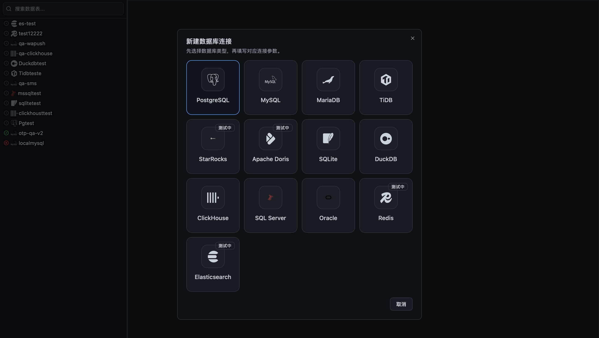
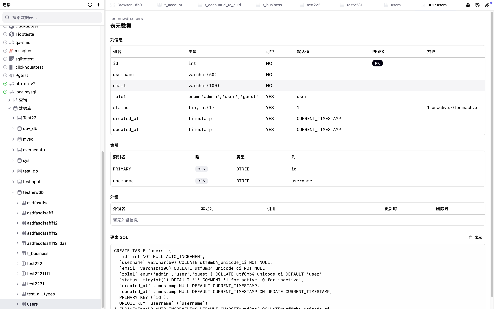

<div align="center">
  
</div>

<h2 align="center">DbPaw</h2>

<div align="center">
<br>
<em>より速い SQL 編集とデータ探索体験 ― クロスプラットフォーム、超軽量、AI アシスタントはオプション。</em>
<br><br>

[English](README.md) | [简体中文](README_CN.md) | 日本語

</div>

<div align="center">

[](https://github.com/codeErrorSleep/dbpaw)
[](https://atomgit.com/codeErrorSleep/dbpaw)
[](https://github.com/codeErrorSleep/dbpaw/releases)
[](https://github.com/codeErrorSleep/dbpaw/releases)
[](LICENSE)
[](https://tauri.app)
<br/>
[](https://www.typescriptlang.org/)
[](https://www.rust-lang.org/)
[](https://v2.tauri.app/)
[](https://github.com/codeErrorSleep/dbpaw/pulls)

</div>

**DbPaw** は PostgreSQL / MySQL / MariaDB（MySQL 互換）/ TiDB（MySQL 互換）/ SQLite / SQL Server / ClickHouse（プレビュー）/ DuckDB / StarRocks / Doris / Oracle / Redis に接続し、SQL の作成・実行とデータ確認を、クリーンなデスクトップ UI で快適に行えます。

## ✅ できること

- PostgreSQL、MySQL、MariaDB（MySQL 互換）、TiDB（MySQL 互換）、SQLite、SQL Server、ClickHouse（プレビュー、現状は読み取り専用）、DuckDB、StarRocks、Doris、Oracle、Redis（Standalone / Cluster / Sentinel）に接続
- SQL の作成・実行（シンタックスハイライト、補完、ワンクリック整形）
- データグリッドで結果を閲覧（フィルタ、ソート、ページネーション）
- テーブルデータやクエリ結果を **CSV・JSON・SQL**（DDL のみ / DML のみ / DDL+DML）でエクスポート。範囲は現在ページ・フィルタ済み行・全件から選択可
- データベース全体を SQL ファイル（スキーマ＋データ）としてエクスポート
- `.sql` ファイルを MySQL/MariaDB/TiDB/PostgreSQL/SQLite/DuckDB/SQL Server へインポート（失敗時は全量ロールバック）
- GUI で**テーブルを作成・変更** — DDL を手書きせず操作可能
- テーブル構造（列・型・主キー・インデックス）と DDL を確認
- **SQL 実行ログ**で全クエリの履歴・実行時間・ステータスを追跡
- `Saved Queries` でよく使う SQL を保存・再利用
- AI サイドバーで SQL 作成補助やクエリ説明（任意）
- SSH トンネル経由でリモート DB に安全に接続
- Redis のデータを閲覧・管理：キー、String、Hash、List、Set、Sorted Set、Stream、JSON（Cluster / Sentinel 対応）

## 🖼️ スクリーンショット


| 接続管理                                       | SQL エディタ                              |
| ---------------------------------------------- | ----------------------------------------- |
|  |  |

| データグリッド                            | AI アシスタント                   |
| ----------------------------------------- | --------------------------------- |
|  |  |

## ✨ 主な機能

- **超軽量**: インストーラは約 10MB、インストール後は約 80MB。常駐メモリも極小（Electron 系ツールを大きく下回ります）。
- **真にモダン**: DBeaver の「コックピット」的な複雑 UI から卒業。開発者が一生使わない 99% をそぎ落とし、よく使うシナリオに集中。より直感的でスムーズな操作感。
- **クロスプラットフォーム**: macOS / Windows / Linux をサポート（職場と自宅で別アプリを使い分ける必要なし）。
- **DB 互換**: 現在は MySQL、MariaDB（MySQL 互換）、PostgreSQL、ClickHouse、TiDB、SQL Server、SQLite、DuckDB、StarRocks、Doris、Oracle、Redis（Standalone / Cluster / Sentinel）に対応（対応拡大中）。
- **豊富なデータ転送**: CSV / JSON / SQL（DDL・DML・両方）へのエクスポート、トランザクション付き SQL インポート＆ロールバック、データベース全体の SQL ダンプに対応。
- **スキーマ管理**: テーブル構造・DDL を閲覧でき、GUI でテーブルの作成・変更も可能。DDL を手書きする必要なし。
- **ルックス良し**: 多数のテーマ（ダーク/ライト、高彩度/低彩度など）を同梱。
- **組み込み AI 支援（実験的）**: SQL 要約、スキーマ説明、遅いクエリ分析などに対応（セキュリティは継続改善中。今後はローカル/選択式クラウドモードを追加予定）。
- **完全無料**: ログイン不要、課金なし、会員機能なし、広告なし。

## 📥 インストール

[Releases](https://github.com/codeErrorSleep/dbpaw/releases) から、お使いの OS 向け最新バージョンをダウンロードしてください。

### macOS

1. [Releases](https://github.com/codeErrorSleep/dbpaw/releases) から macOS 版 `DbPaw` をダウンロード
2. `DbPaw.app` を `/Applications` フォルダへ移動
3. アプリを起動

macOS で「未確認の開発元」と表示されて起動をブロックされた場合:

1. **システム設定** → **プライバシーとセキュリティ** を開く
2. **セキュリティ** セクションで `DbPaw` がブロックされた旨の表示を探す
3. **このまま開く** をクリックし、確認ダイアログで **開く** を選択

「DbPaw は破損しているため開けません」（Gatekeeper の隔離属性）と表示される場合:

1. `DbPaw.app` を `/Applications` フォルダへ移動
2. **ターミナル**を開き、次を実行
   ```bash
   sudo xattr -d com.apple.quarantine /Applications/DbPaw.app
   ```
3. 通常どおり起動可能になります

_注: 現時点では Apple の notarization（公証）が未完了のため、この対応が必要になる場合があります。_

### Windows

1. [Releases](https://github.com/codeErrorSleep/dbpaw/releases) からインストーラまたはポータブル版をダウンロード
2. インストーラ / 実行ファイルを起動

「Windows によって PC が保護されました」（SmartScreen）などの警告が表示される場合:

1. **詳細情報** をクリック
2. **実行** をクリック

組織管理端末の場合、IT 管理者による許可が必要なことがあります。

## 🔐 セキュリティとプライバシー

- DbPaw はローカルデスクトップアプリです。DB 接続はあなたの端末から直接データベースへ行われます。
- AI 機能は任意です。有効化すると、プロンプト、直近の会話コンテキスト、必要に応じてスキーマ概要（テーブル/カラム/型）を、設定した AI プロバイダーへ送信します。
- AI 会話はローカルに保存され、AI プロバイダーの API キーはローカルディスク上で暗号化保存されます。
- デスクトップアプリには、標準でテレメトリ / 分析 SDK は組み込まれていません。

## 🛠️ 開発

- 開発ガイド：[docs/ja/Development/DEVELOPMENT.md](docs/ja/Development/DEVELOPMENT.md)
- コントリビューション：[docs/ja/Community/CONTRIBUTING.md](docs/ja/Community/CONTRIBUTING.md)

## 🏗️ 技術スタック

- **Core**: [Tauri v2](https://v2.tauri.app/)（Rust）
- **Frontend**: [React 19](https://react.dev/), [TypeScript](https://www.typescriptlang.org/)
- **Styling**: [TailwindCSS v4](https://tailwindcss.com/), [Shadcn/UI](https://ui.shadcn.com/)
- **State Management**: React Hooks & Context
- **Editor**: [Monaco Editor](https://microsoft.github.io/monaco-editor/) / CodeMirror

## 📄 ライセンス

このプロジェクトは Apache License 2.0 のもとで提供されています。詳細は [LICENSE](LICENSE) を参照してください。

## ❤️ Thanks

DbPaw を試していただきありがとうございます。役に立った場合は、ぜひリポジトリに Star をお願いします。
